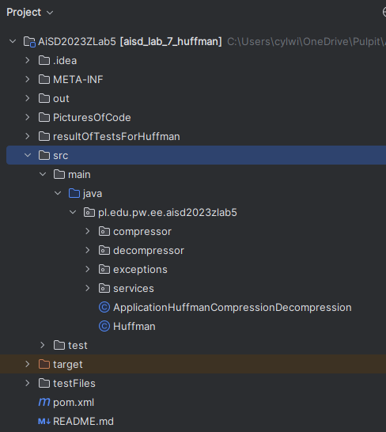
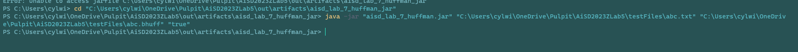

# Huffman Compressor/Decompressor

### 

## Sposób użycia
>Przy uzyciu programu należy podać 3 argumenty 
* ścieżka pliku który bedzie uzytu do operacji programu
* ścieżka pliku lub directory do którego zapisywany jest rezultat operacji programu ( __jeśli to dekompresja, trzeba podac ścieżke pliku, bo potrzebne jest rozszerzenie, w innym przpyadku wyrzuci wyjątek__)
* true lub false, true - kompresja, false - dekompresja


Przykład użycia w terminalu:

### 
```bash
java -jar NazwaProgramu.jar [plikDoOperacji] [plikRezultowy] [true/false] (w zaleznosci czy kompresja czy dekompresja)
```
## Sposób zapisania dla pliku skompresowanego

>Plik sompresowany mozna podzielić na 3 częsci:
> * Słownik w postaci przejścai drzewa preorder:
> > Kiedy przochodzimy przez drzewo w lewo wtawiany jst bit 0, kiedy jest node jest liściem to bit 1, i zawsze bo bicie oznaczajacym lisc, byte definiujący liść np: [0,1,A,1,B,0,1,C,1,D]
> * Odra po przejściu słownika zapisawyny jest plik wejściowy w postaci nowych kodów Huffmana
> * Na koniec dopełnienie bajtowe, zawsze po 2 podpunkcie zapisywany jest Marker ozaczajacy bit 1 a po nim, jeśli jest potrzeba wypełnienia bajta 0, pozwala to łatwo zidentyfikować, kiedy nie należy czytać dalej kodów, przy dekodowaniu
> >** Plik skompresowany ma rozszerzenie .bhuff**
